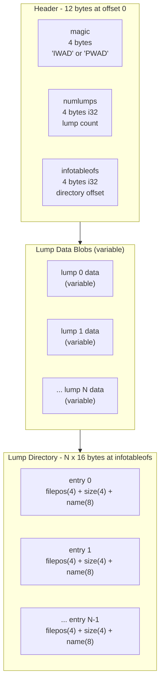
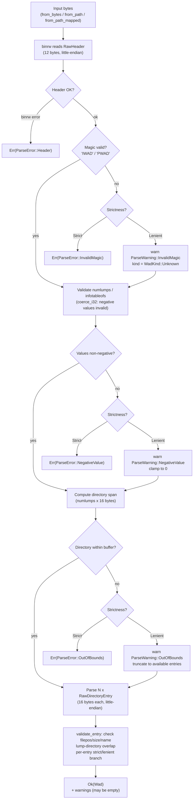
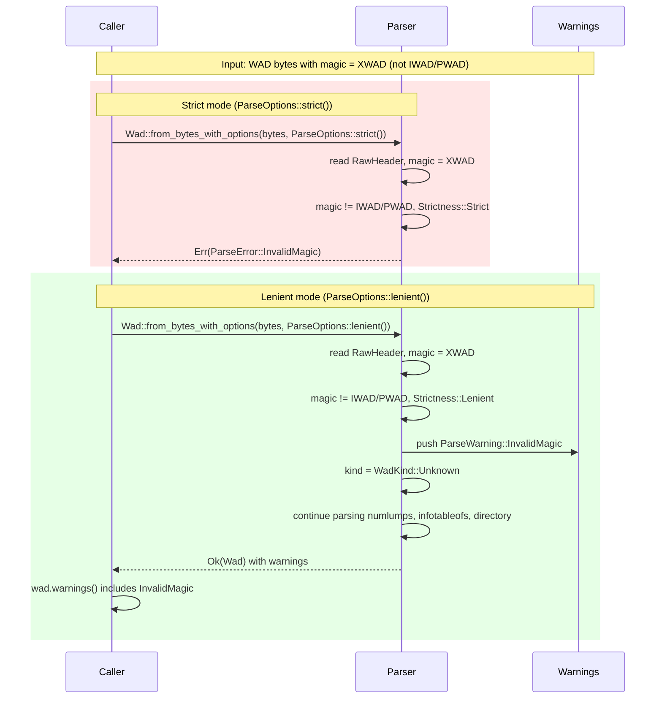
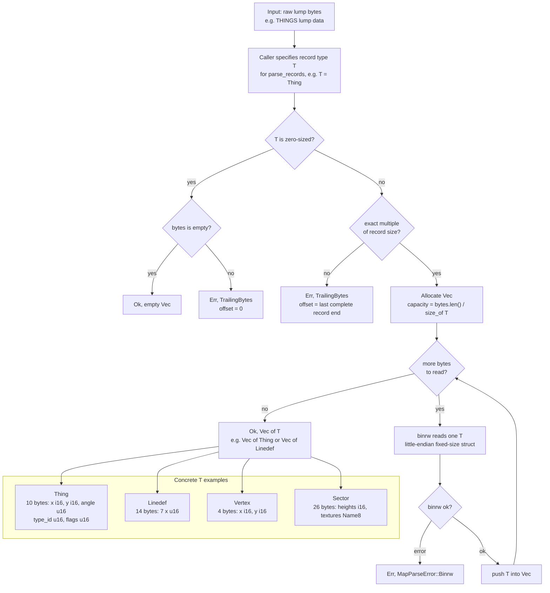

# Design

## Goals

- Provide a small, safe Rust library for Doom WAD file I/O.
- Start with reliable header and lump-directory reading.
- Keep the API ready for future write support, async I/O, zero-copy parsing, and optional memory mapping.

## Non-goals

- Full map graph assembly in this milestone.
- Write support in this milestone.
- Async runtime integration in this milestone.

## Data model

A WAD contains a 12-byte header, lump data blobs, and a directory of 16-byte lump entries. The header stores the byte offset at which the directory begins; in practice the directory sits after all lump data at the end of the file. `crustywad` models the file as owned bytes plus validated metadata for the parsed header and lump directory.

### WAD File Format

The diagram below shows the on-disk layout of a WAD file. The header is always at offset 0 and is exactly 12 bytes. Lump data blobs can appear anywhere in the file; each directory entry's `filepos` and `size` fields locate the blob. The lump directory sits at the byte offset stored in `infotableofs` (typically at the end of the file). Each directory entry is exactly 16 bytes and describes one lump.

## Read pipeline

1. Read the file into owned bytes.
2. Parse the header with `binrw` using little-endian integers.
3. Validate or recover header fields according to `ParseOptions`.
4. Parse the lump directory.
5. Clamp invalid lump ranges in lenient mode and collect warnings.

### Read Pipeline Flowchart

The flowchart below traces how bytes become a `Wad`. `Strictness` only affects semantic validation: strict mode returns `Err(ParseError)` immediately; lenient mode pushes a `ParseWarning` and continues. Binary decode errors from `binrw` — for both the header and directory entries — are always fatal regardless of mode.

## Strict vs. lenient parsing

`Strictness::Strict` treats malformed magic, negative counts, out-of-range offsets, oversized lumps, and non-ASCII names as hard errors.

`Strictness::Lenient` keeps parsing when possible, returning a `Wad` plus collected warnings. In lenient mode, invalid directory sizes are truncated to the number of complete entries that fit in the buffer and invalid lump byte ranges are clamped into a safe slice.

### Strict vs. Lenient Mode Comparison

The sequence diagram below shows how the same malformed WAD (bad magic bytes) flows through each mode. Strict mode returns an error immediately; lenient mode records a warning and proceeds to produce a usable `Wad`.

## Map record parsing

### Map Record Parsing Flowchart

`parse_records::<T>` turns raw lump bytes into a typed vector using `binrw`. The generic parameter `T` may be any map record type (`Thing`, `Linedef`, `Sidedef`, `Vertex`, `Seg`, `Subsector`, `Node`, `Sector`) that implements `BinRead<Args<'_> = ()>`. Zero-sized types (`size_of::<T>() == 0`) are handled as a special case before the modulo check: an empty buffer yields an empty `Vec`, and a non-empty buffer is an unconditional `TrailingBytes` error. For all other types, records are read sequentially until the cursor reaches the end of the slice.

## Feature plan

- `mmap`: enables `Wad::from_path_mapped[_with_options]` for read-only memory-mapped file loading via `memmap2`; `from_path` always reads into memory regardless of this flag.
- `freedoom-tests`: optional integration tests that inspect downloaded FreeDoom fixtures.
- Future `async`: alternate I/O constructors without changing the in-memory parse model.
- Future zero-copy: borrowed views over validated bytes.

## Milestones

1. Header and directory parsing
2. Map lump record parsing
3. Graphics and patches
4. Texture composition
5. Audio lumps
6. Writing support

## Testing strategy

- Synthetic WAD builders for offline unit and integration tests.
- Optional FreeDoom fixture coverage for real-world inputs.
- `proptest` for parser invariants.
- Future fuzzing and criterion benchmarks once the API surface expands.
