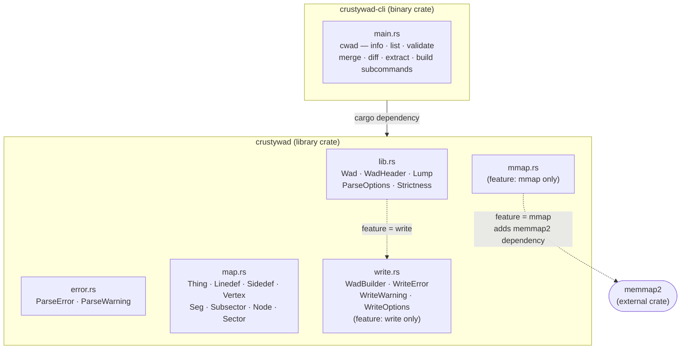
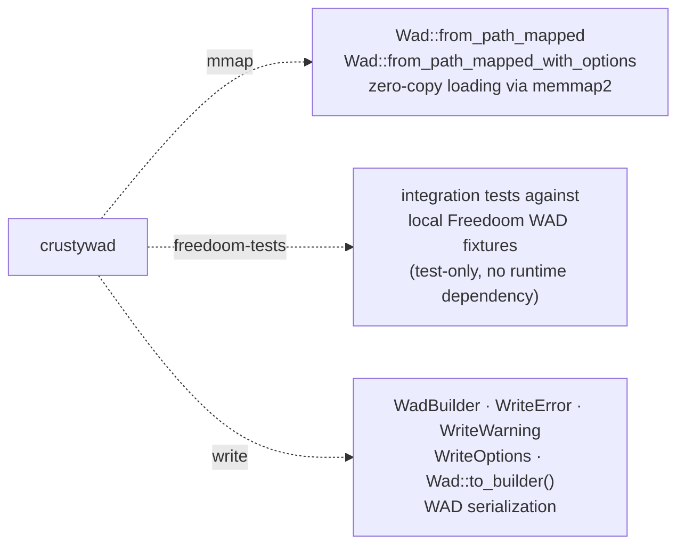

# Architecture

> **Audience:** Library users and contributors

## Workspace layout

The workspace contains two crates. `crustywad-cli` depends on `crustywad`; the library has no dependency on the CLI.

## Feature flags

