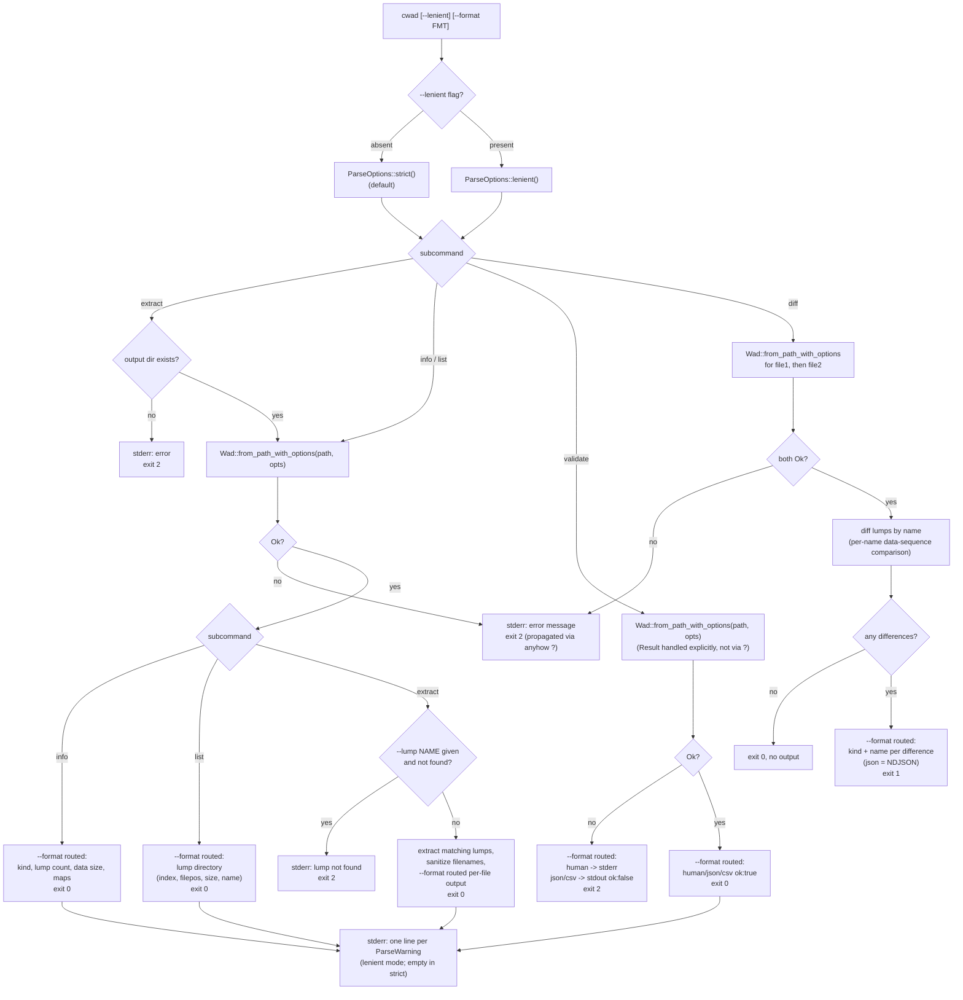
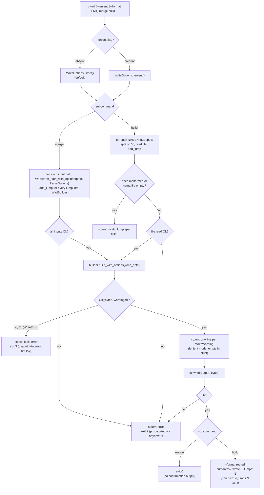

# CLI Flow

> **Audience:** Library users

The `cwad` binary exposes seven subcommands: `info`, `list`, `validate`, `diff`, and `extract` (read-only) plus `merge` and `build` (write-path, require the `write` feature). `--lenient` and `--format` (`-F`; `human` default, `json`, or `csv`) are global flags that apply to every subcommand. Warnings are always written to stderr; normal output routes through `--format`. Argument-parsing failures (via `clap`) exit `3` before any subcommand runs, regardless of which subcommand was given.

## Read-path dispatch

`info`, `list`, `validate`, `diff`, and `extract` all read one or more WADs via `Wad::from_path_with_options` under `ParseOptions::strict()`/`lenient()`. `validate` handles its load `Result` explicitly so it can route both outcomes through `--format`; the other read subcommands propagate load failures via `anyhow`'s `?`, which `main` catches and turns into exit `2`. `extract` additionally exits `2` if a requested `--lump NAME` isn't found in the WAD (a separate explicit check after a successful load).

## Write-path dispatch

`merge` and `build` construct a WAD via `WadBuilder` and require the `write` feature. `--lenient` selects `WriteOptions::strict()`/`lenient()` for the build step, distinct from (but analogous to) the read-side `ParseOptions`. `WriteError` from `build_with_options` is a usage/data error and exits `3`; I/O failures (reading input files, writing the output file) still propagate via `?` and exit `2`, mirroring the read-path exit codes.

