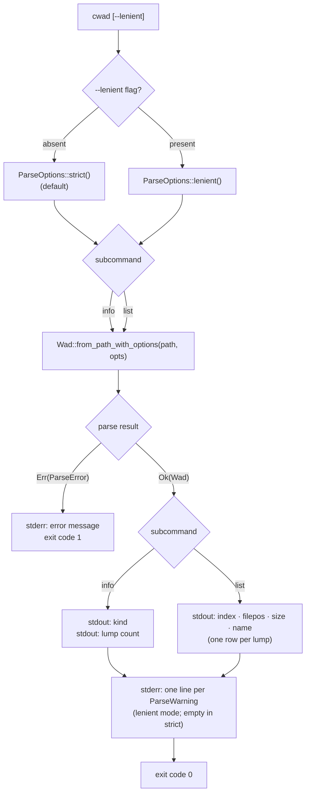

# CLI Flow

> **Audience:** Library users

The `cwad` binary exposes two subcommands. The `--lenient` flag is global and switches the parser to lenient mode for the entire invocation. Warnings are always written to stderr; normal output goes to stdout.

> **Note:** Issue #95 referenced `--format` routing as a candidate for this diagram. The current CLI has no `--format` flag; this diagram reflects the implemented interface only.

