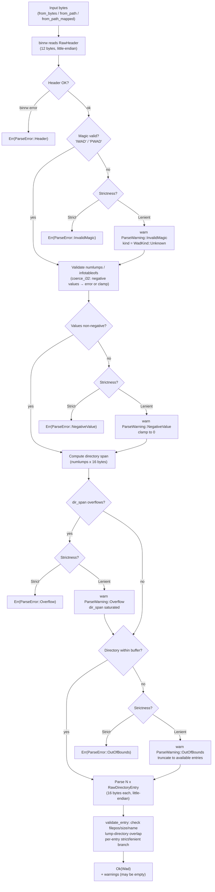
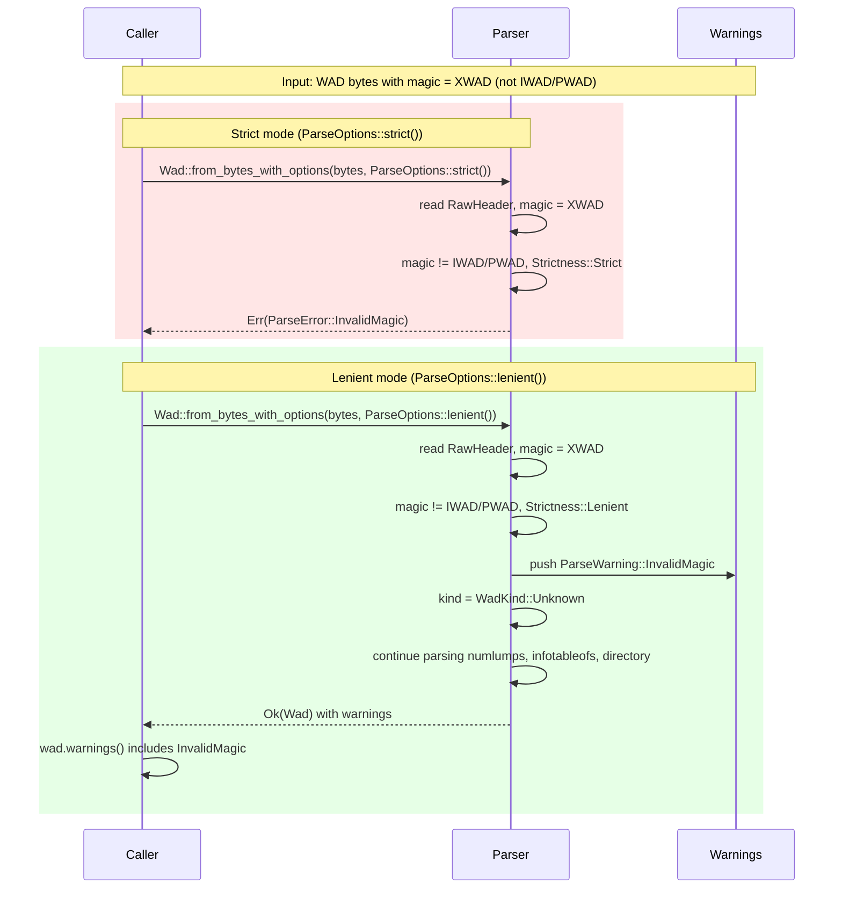
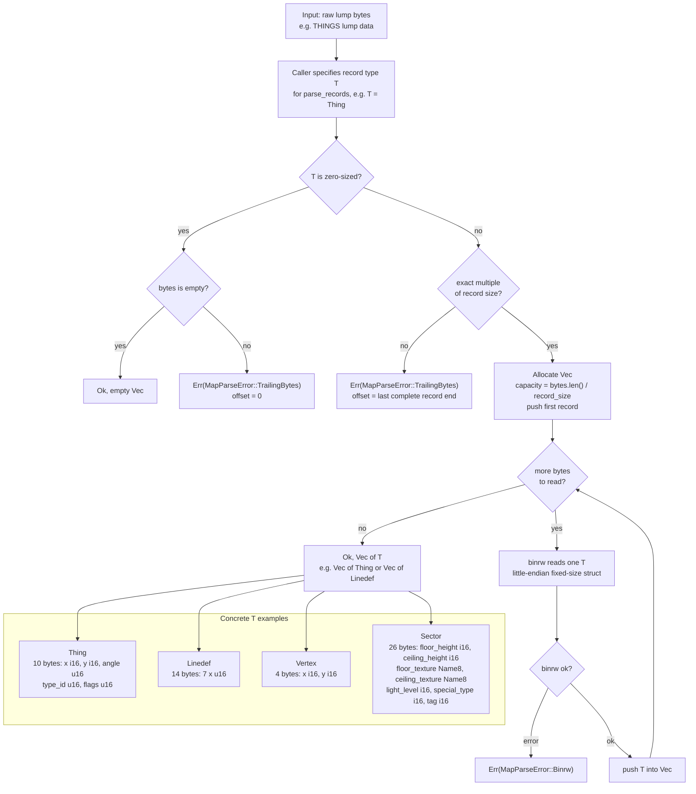

# Data Flow

> **Audience:** Contributors

## Read pipeline

`Strictness` only affects semantic validation: strict mode returns `Err(ParseError)` immediately; lenient mode pushes a `ParseWarning` and continues. Binary decode errors from `binrw` — for both the header and directory entries — are always fatal regardless of mode.

## Strict vs. lenient mode

The sequence diagram below shows how the same malformed WAD (bad magic bytes) flows through each mode. Strict mode returns an error immediately; lenient mode records a warning and proceeds to produce a usable `Wad`.

## Map record parsing

`parse_records::<T>` turns raw lump bytes into a typed vector using `binrw`. The generic parameter `T` may be any map record type (`Thing`, `Linedef`, `Sidedef`, `Vertex`, `Seg`, `Subsector`, `Node`, `Sector`) that implements `BinRead<Args<'_> = ()>`. An empty buffer always yields an empty `Vec`. Otherwise the function parses the first record and measures how many bytes `BinRead` consumed (`record_size = cursor.position()`); this avoids relying on `size_of::<T>()`, which reflects in-memory layout rather than on-disk size. If `record_size == 0` the type has no on-disk representation and any non-empty input is a `TrailingBytes` error. If the total length is not an exact multiple of `record_size`, the remaining partial bytes are a `TrailingBytes` error.

