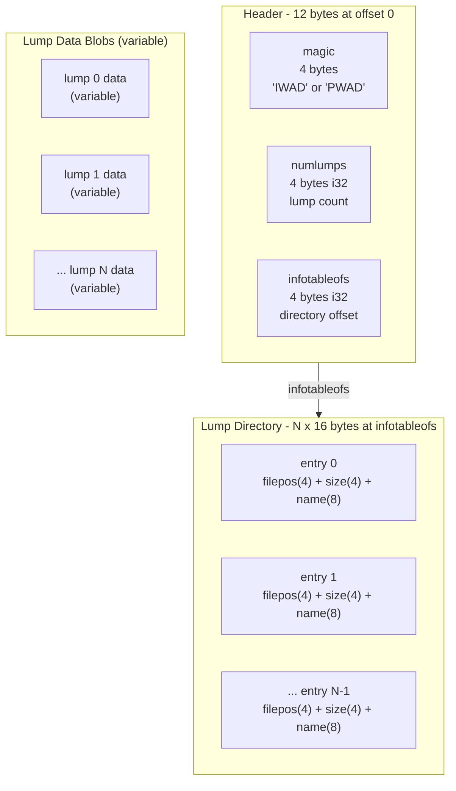
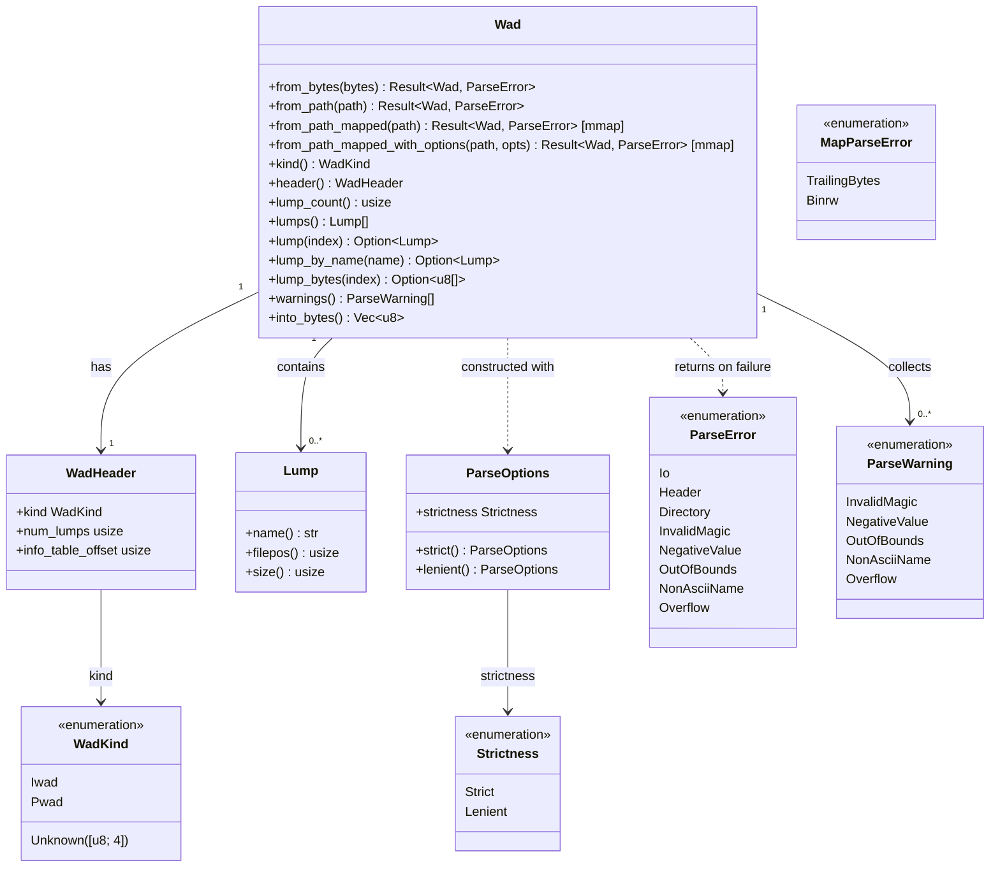

# Data Model

> **Audience:** Library users

## WAD on-disk layout

The header is always at offset 0 and is exactly 12 bytes. Lump data blobs can appear anywhere in the file; each directory entry's `filepos` and `size` fields locate the blob. The lump directory sits at the byte offset stored in `infotableofs` (typically at the end of the file). Each directory entry is exactly 16 bytes and describes one lump.

## Rust type relationships

The class diagram below shows the public API types in `crustywad` and how they relate to each other. Constructors return `Result<Wad, ParseError>`; in lenient mode the returned `Wad` carries zero or more `ParseWarning` values accessible via `Wad::warnings`. Methods marked `[mmap]` are only available when the `mmap` feature flag is enabled.

