# Lump Hierarchy

> **Audience:** Contributors

Lumps in a WAD file are undifferentiated byte blobs at the format level — each identified only by an 8-byte name, a file offset, and a size. This diagram shows the conventional taxonomy used by the Doom engine and followed by `crustywad`'s typed structs.

The root node represents the **on-disk directory entry** (raw fields as stored in the WAD). The public `Lump` API type exposes these as a decoded `&str` name and `usize` offsets.

```mermaid
graph TD
    Lump["WAD directory entry (on-disk)\nname: [u8; 8] · filepos: i32 · size: i32"]

    Lump --> Map["Map group\n(follows a map-marker lump, e.g. E1M1 / MAP01)"]
    Lump --> NS["Namespace markers\n(delimit resource namespaces)"]
    Lump --> Special["Special lumps\n(global resources)"]
    Lump --> Raw["Untyped lumps\n(passthrough blobs)"]

    Map --> THINGS["THINGS → Thing\n10 bytes per record"]
    Map --> LINEDEFS["LINEDEFS → Linedef\n14 bytes per record"]
    Map --> SIDEDEFS["SIDEDEFS → Sidedef\n30 bytes per record"]
    Map --> VERTEXES["VERTEXES → Vertex\n4 bytes per record"]
    Map --> SEGS["SEGS → Seg\n12 bytes per record"]
    Map --> SSECTORS["SSECTORS → Subsector\n4 bytes per record"]
    Map --> NODES["NODES → Node\n28 bytes per record"]
    Map --> SECTORS["SECTORS → Sector\n26 bytes per record"]
    Map --> REJECT["REJECT → RejectLump\n(stub — not yet parsed)"]
    Map --> BLOCKMAP["BLOCKMAP → BlockmapLump\n(stub — not yet parsed)"]

    NS --> SS["S_START / S_END\n(sprite namespace)"]
    NS --> PP["P_START / P_END\n(patch namespace)"]
    NS --> FF["F_START / F_END\n(flat / floor texture namespace)"]

    Special --> PLAYPAL["PLAYPAL\n(color palettes — planned)"]
    Special --> COLORMAP["COLORMAP\n(light level tables — planned)"]
    Special --> TEXTURE["TEXTURE1 / TEXTURE2\n(wall texture definitions — planned)"]
    Special --> PNAMES["PNAMES\n(patch name list — planned)"]
```

Structs for the map group are defined in `crates/crustywad/src/map.rs` and parsed via `parse_records::<T>`. Items marked **stub** have a zero-sized placeholder type. Items marked **planned** are future milestones with no current typed struct.
